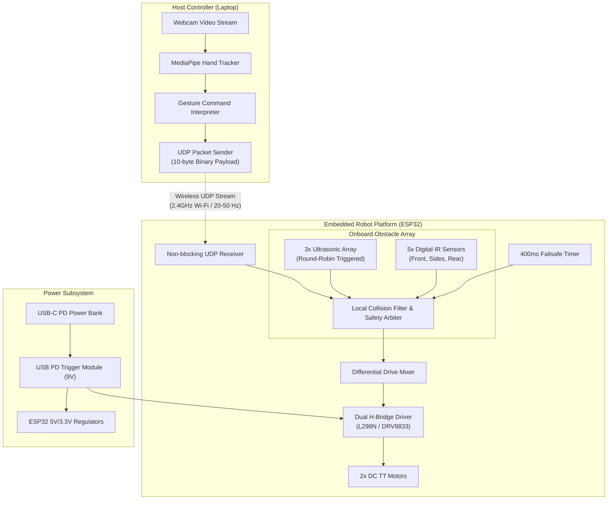

# System Architecture & Safety Model

This document outlines the distributed system architecture of the Gesture-Controlled Differential-Drive Robot and provides the rationale behind local, embedded safety enforcement.

---

## 1. System Block Diagram



---

## 2. Why Collision Avoidance is Enforced Locally on the ESP32

A foundational design choice in this architecture is the **strict separation of remote command intent from physical motor actuation**. The host laptop issues desired velocities, but the onboard ESP32 maintains absolute authority over safety-critical execution.

### Rationale:

1. **Wireless Latency & Jitter**:
   - Standard 802.11 Wi-Fi can introduce unpredictable packet delays ranging from 5 ms up to hundreds of milliseconds due to RF interference, beacon pauses, and background operating system scheduling on the laptop.
   - At a typical robot linear speed of 0.5 m/s, a 200 ms network hiccup equates to 10 cm of unmonitored travel—often the difference between stopping in time and a damaging collision.

2. **Packet Loss & Transport Unreliability**:
   - UDP is connectionless and does not retransmit dropped packets.
   - If the host laptop were solely responsible for detecting an obstacle and sending a "STOP" packet, a dropped datagram at the moment of impending impact would lead to a catastrophic crash.

3. **Host Software Freezes & Operating System Scheduling**:
   - Python garbage collection pauses, heavy MediaPipe neural network workloads, or camera driver lag can momentarily stall the gesture-tracking thread on the laptop.
   - The ESP32 runs a bare-metal RTOS control loop at high frequencies (~200 Hz), guaranteeing sub-millisecond deterministic sensor sampling and actuator response times.

4. **Zero-Trust Safety Guarantee**:
   - By embedding the `collision_filter` on the ESP32, the robot guarantees collision avoidance regardless of what the remote commander attempts to transmit (e.g., commanding full forward into a wall).
   - If Wi-Fi disconnects entirely or the laptop app crashes, the 400 ms watchdog failsafe timer immediately halts all motor activity.

---

## 3. Sensor Array Placement & Safety Strategy

```
               [Front-Left US (~45°)]   [Front-Center US (0°)]   [Front-Right US (~45°)]
                          \                     |                     /
                           \                    |                    /
                         +-----------------------------------------------+
                         |   [IR Front-L]                [IR Front-R]    |
                         |                     FRONT                     |
                         |                                               |
     [IR Side-Left] ---> | [Left Wheel]                    [Right Wheel] | <--- [IR Side-Right]
                         |                                               |
                         |                     REAR                      |
                         |                 [IR Rear-C]                   |
                         +-----------------------------------------------+
                                                |
                                                v
                                        [Rear Blindspot]
```

### Safety Zones & Arbitration Matrix

| Zone | Sensors | Behavior / Safety Action |
|------|---------|--------------------------|
| **Front Approaching** | 3x Ultrasonic (Left, Center, Right) | Proportional linear slowdown between 40 cm and 15 cm. Full forward stop if $\le 15\text{ cm}$. |
| **Front Immediate** | 2x Low-mounted Digital IR | Immediate hard stop of positive forward velocity (`linear = 0`). Reverse drive permitted. |
| **Flank (Left)** | Mid-Left Digital IR | Binary gate: Disallow left yaw rotation (`angular < 0` zeroed). Straight or right turns permitted. |
| **Flank (Right)**| Mid-Right Digital IR | Binary gate: Disallow right yaw rotation (`angular > 0` zeroed). Straight or left turns permitted. |
| **Rear** | Rear-Center Digital IR | Binary gate: Disallow reversing (`linear < 0` zeroed). Forward driving permitted. |
| **Communication Loss** | Software Watchdog | If elapsed packet time $> 400\text{ ms}$, force `(linear = 0, angular = 0)`. |
